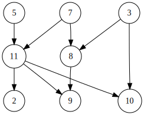

# Topological sorting

 Topological sort or topological ordering of a directed graph is a linear ordering of its vertices such that for every directed edge uv from vertex u to vertex v, u comes before v in the ordering. The graph may have many valid topological sorts.

 The graph below has these topological sorts:

 5, 7, 3, 11, 8, 2, 9, 10 (visual left-to-right, top-to-bottom)

3, 5, 7, 8, 11, 2, 9, 10 (smallest-numbered available vertex first)

5, 7, 3, 8, 11, 10, 9, 2 (fewest edges first)

7, 5, 11, 3, 10, 8, 9, 2 (largest-numbered available vertex first)

5, 7, 11, 2, 3, 8, 9, 10 (attempting top-to-bottom, left-to-right)

3, 7, 8, 5, 11, 10, 2, 9 (arbitrary)




## Time Complexity

O(|E| + |V|)

## Algorithm

  * Kahn's algorithm

    >Choosing vertices in the same order as the eventual topological sort. First, find a list of "start nodes" which have no incoming edges and insert them into a set S; at least one such node must exist in a non-empty acyclic graph. If the graph is a DAG, a solution will be contained in the list L (the solution is not necessarily unique). Otherwise, the graph must have at least one cycle and therefore a topological sorting is impossible.

  * Depth-first search

    >The algorithm loops through each node of the graph, in an arbitrary order, initiating a depth-first search that terminates when it hits any node that has already been visited since the beginning of the topological sort or the node has no outgoing edges (i.e. a leaf node)
  
## Code

  ```python
  class Graph(object):        
      def __init__(self, edges):
          self._graph = defaultdict(set)
          self.add_edges(edges)
      
      def add_edges(self, edges):
          for edge in edges:
              self.add_edge(edge)
             
      def add_edge(self, edge):
          self._graph[edge.source].add(edge.dest)
            
      def vertexes(self, source):
           return self._graph[source]

from collections import deque

def sortutil(graph, v, visited, q):
    visited[v] = True
    
    for i in graph.vertexes(v):
        if not visited[i]:
            sortutil(graph, i, visited, q)
            
    q.appendleft(v)        
    
def topological_sort(graph, N):
    visited = [False for _ in range(N)]
    q = deque()
    
    for i in range(N):
        if not visited[i]:
           sortutil(graph, i, visited, q) 
        
    print(q)  
  ```

References:

[https://en.wikipedia.org/wiki/Topological_sorting](https://en.wikipedia.org/wiki/Topological_sorting)

[Topological Sort Algorithm for DAG using DFS](http://www.techiedelight.com/topological-sorting-dag/)

[Topological Sorting](https://www.geeksforgeeks.org/topological-sorting/)


