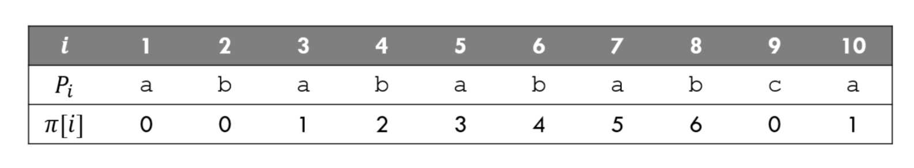

# Knuth-Morris-Pratt (KMP)

## Problem

Given a text `T` and a pattern `P`, find all occurrences of `P` within `T`

## Algorithm

Main idea is to skip some comparisons by using the previous comparison result.
The KMP Algorithm cleverly make use of previous comparison’s data. It can search a pattern in O(n) time as it never re-compares a text symbol that has matched a pattern symbol. However, it uses a partial match table to analyze the pattern structure. Construction of partial match table takes O(m) time.

The partial table is built according to this rule: **The length of the longest proper prefix in the (sub)pattern that matches a proper suffix in the same (sub)pattern.**


π[i]isthelargestintegersmallerthanisuchthatP1...Pπ[i] is a suffix of P1 ...Pi

e.g., π[6] = 4 since abab is a suffix of ababab

e.g., π[9] = 0 since no prefix of length ≤ 8 ends with c

## Time Complexity

O(m + n), `m` is the length of `P` and `n` is the length of `T`.

## Code

  ```python
   class KMP:
    def partial(self, pattern):
        ret = [0]
        
        for i in range(1, len(pattern)):
            j = ret[i - 1]
            while j > 0 and pattern[j] != pattern[i]:
                j = ret[j - 1]
            ret.append(j + 1 if pattern[j] == pattern[i] else j)
            
        return ret
    
    def search(self, T, P):
        partial, ret, j = self.partial(P), [], 0
        i = 0
        for i in range(len(T)):
            while j > 0 and T[i] != P[j]:
                j = partial[j - 1]
            if T[i] == P[j]: 
                j += 1
                
            if j == len(P):
                ret.append(i - (j - 1))
                j = partial[j - 1]    
        return ret
  ```

## References

[String Algorithms](https://web.stanford.edu/class/cs97si/10-string-algorithms.pdf)

[Python KMP algorithm](https://gist.github.com/m00nlight/daa6786cc503fde12a77)

[9.1 Knuth-Morris-Pratt KMP String Matching Algorithm](https://www.youtube.com/watch?v=V5-7GzOfADQ)

[Implementation of KMP Algorithm in C, C++ and Java](http://www.techiedelight.com/implementation-kmp-algorithm-c-cpp-java/)

[Knuth–Morris–Pratt algorithm](https://en.wikipedia.org/wiki/Knuth–Morris–Pratt_algorithm)

[Searching for Patterns](https://www.geeksforgeeks.org/searching-for-patterns-set-2-kmp-algorithm/)

[The Knuth-Morris-Pratt Algorithm in my own words](http://jakeboxer.com/blog/2009/12/13/the-knuth-morris-pratt-algorithm-in-my-own-words/)