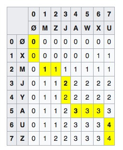

# Longest common subsequence (LCS) problem

The longest common subsequence (LCS) problem is the problem of finding the longest common subsequence which differs from the longest common substring problem. It is widely used by revision control systems such as `git diff`.

## Time complexity

For the case of two sequences of n and m elements, the running time of the dynamic programming approach is O(n × m)

## Solution

Let two sequences be defined as follows: X = (x1, x2...xm) and Y = (y1, y2...yn). The prefixes of X are X1, 2,...m; the prefixes of Y are Y1, 2,...n. Let LCS(Xi, Yj) represent the set of longest common subsequence of prefixes Xi and Yj. This set of sequences is given by the following.


## Implementation

A matrix can be used to backtrack difference between the two sequences. The highlighted numbers show the path of the LCS. For example: The LCS of "XMJYAUZ" and "MZJAWXU" is "MJAU".




```python

   def lcs_length(x, y):
    m = len(x)
    n = len(y)
    
    t = [[0 for a in range(n + 1)] for b in range(m + 1)]
    
    for i in range(m):
        for j in range(n):
            if x[i] == y[j]:
                t[i + 1][j + 1] = t[i][j] + 1
            else:
                t[i + 1][j + 1] = max(t[i+1][j], t[i][j+1])            
    return t

   def lcs(x, y, m, n, t):
         if  m == 0 or n == 0:
             return [""]
         if x[m - 1] == y[n - 1]:
            all_strings = lcs(x, y, m - 1, n - 1, t)
            for idx, value in enumerate(all_strings):       
                 value += x[m - 1]
                 all_strings[idx] = value
            return all_strings
         
         if t[m - 1][n] > t[m][n - 1]:
            return  lcs(x, y, m - 1, n, t)
   
         if t[m][n - 1] > t[m - 1][n]:   
            return lcs(x, y, m , n - 1, t)
           
         left =  lcs(x, y, m , n - 1, t)
         top =  lcs(x, y, m - 1, n, t)
         return  top + left
   
   def lcs_print(x, y):
          t = lcs_length(x, y)
          print set(lcs(x, y, len(x), len(y), t))
```


References:

[Longest common subsequence problem](https://en.wikipedia.org/wiki/Longest_common_subsequence_problem)

[Longest Common Subsequence | Finding all LCS](http://www.techiedelight.com/longest-common-subsequence-finding-lcs/)