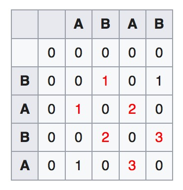

# Longest common substring

The longest common substring problem is to find the longest string (or strings) that is a substring (or are substrings) of two or more strings. Given two strings, `S` of length `m` and `T` of length `n`, find the longest strings which are substrings of both `S` and `T`.

## Time Complexity

Dynamic programming approash costs `O(mn)`, and using suffix tree costs `O(m + n)`

## Dynamic programming

The longest common suffix is


For the example strings "ABAB" and "BABA":



The longest substrings are shown on diagonals, in red, in the table. For this example, the longest common substrings are "BAB" and "ABA".

```python
  def lcsubtring(string1, string2):
    m = len(string1)
    n = len(string2)
    maxlen, endidx = 0, 0
    lookup = [[0 for _ in range(n + 1)] for _ in range(m + 1)]
    
    for i in range(1, m + 1):
       for j in range(1, n + 1):
          if string1[i - 1] == string2[j - 1]:
              lookup[i][j] = lookup[i - 1][j - 1] + 1
              if maxlen < lookup[i][j]:
                  maxlen = lookup[i][j]
                  endidx = i

    return string1[endidx - maxlen: endidx]
```


References:

[Longest common substring problem](https://en.wikipedia.org/wiki/Longest_common_substring_problem)

[Longest Common Substring problem](http://www.techiedelight.com/longest-common-substring-problem/)

[Longest common substring problem suffix array](https://www.youtube.com/watch?v=Ic80xQFWevc)